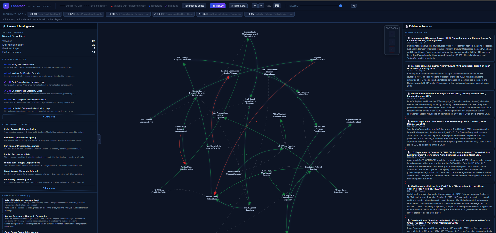
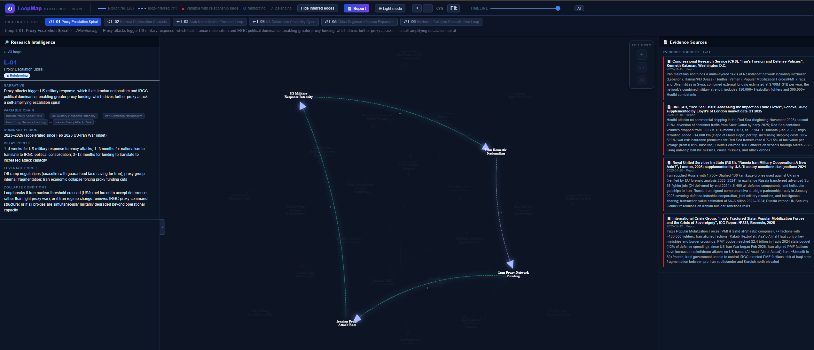
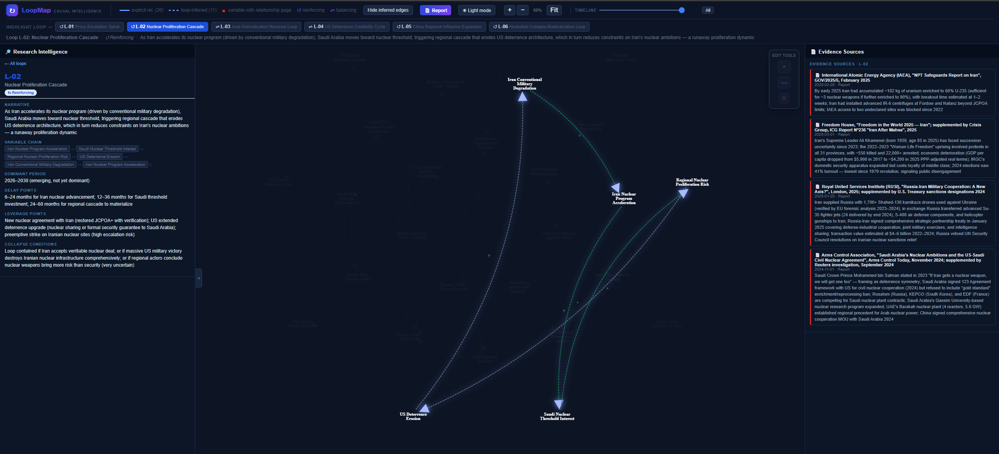
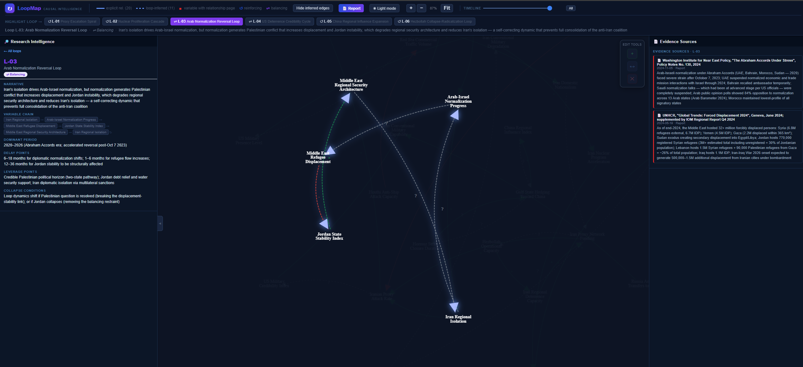
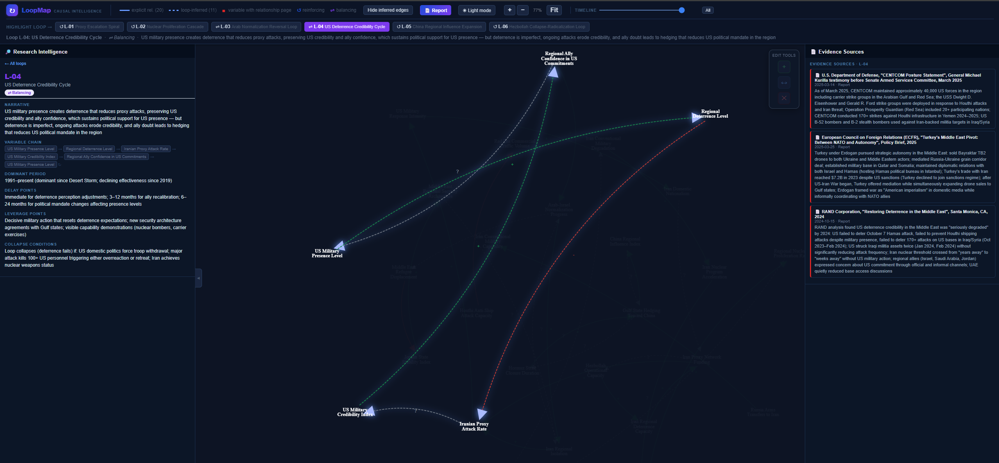
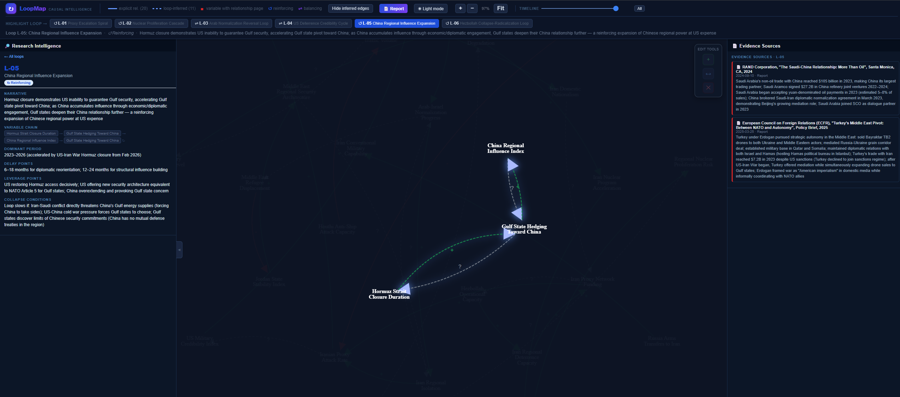
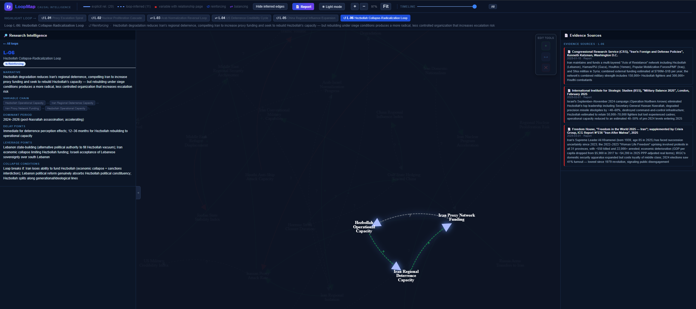

# LoopMap — Causal Intelligence Research Framework

> **AI agents summarize. LoopMap makes them think — tracing causes, surfacing feedback loops, anchoring every claim to a dated source.**

Write your research in plain Markdown. Run one Python script. Get an interactive causal map where every loop is one click away.



---

## Overview

We've gotten very good at predicting things we don't understand.

AI tells us which customers will churn, which loans will default, which tumors are malignant — without ever explaining the mechanism. It works, so we stop asking why.

But it breaks the moment something changes. A new policy. A market shock. A new competitor. Behavior models reflect the past. They have no theory of what happens next.

That gap is what we built LoopMap to close — an open-source framework where AI agents construct causal maps from research. Every claim sourced. Every arrow backed by evidence. Every loop traceable to its root.

The input is simple: *"research the escalation dynamics of the Mideast-geopolitics."*

What comes back isn't a summary or a list of bullet points. It's a map of how the system holds itself together — the reinforcing loops between domestic political pressure and military posturing, the leverage points buried three steps away from where everyone is looking, the variables that seem irrelevant until you see what they connect to.

And because the agents work from research, not intuition, every node and every link traces back to a source. Nothing is asserted — everything is cited.

**Not what happened. Why it keeps happening.**

I got tired of asking AI for answers and getting summaries. LoopMap is what we built instead.

Geopolitics is just one application. The same approach maps telco churn dynamics, competitive strategy, organizational dysfunction — anywhere behavior emerges from feedback rather than linear cause.

---

## Every feedback loop, isolated at a click

Click any loop button in the toolbar — the diagram dims everything else and highlights exactly the variables and arrows that form that loop. Evidence sources update in the right panel in real time.

<table>
<tr>
<td align="center" width="50%">

**L-01 · Proxy Escalation Spiral** · ↺ Reinforcing



Proxy attacks trigger US response, fueling Iranian nationalism and more proxy funding — a self-amplifying escalation engine.

</td>
<td align="center" width="50%">

**L-02 · Nuclear Proliferation Cascade** · ↺ Reinforcing



Iran's military degradation accelerates its nuclear program, pushing Saudi Arabia toward threshold interest, which erodes US deterrence architecture further.

</td>
</tr>
<tr>
<td align="center" width="50%">

**L-03 · Arab Normalization Reversal** · ⇌ Balancing



Iran's isolation drives Arab-Israel normalization, but normalization generates Palestinian displacement and Jordan instability — a self-correcting brake on the anti-Iran coalition.

</td>
<td align="center" width="50%">

**L-04 · US Deterrence Credibility Cycle** · ⇌ Balancing



US military presence deters proxy attacks, preserving credibility — but ongoing attacks erode it, and ally doubt leads to hedging that shrinks the US mandate in the region.

</td>
</tr>
<tr>
<td align="center" width="50%">

**L-05 · China Regional Influence Expansion** · ↺ Reinforcing



Hormuz closure signals US inability to guarantee Gulf security, accelerating Gulf state pivot toward China — whose growing presence deepens the hedging further.

</td>
<td align="center" width="50%">

**L-06 · Hezbollah Collapse-Radicalization** · ↺ Reinforcing



Hezbollah degradation compels Iran to fund rebuilding, but reconstruction under siege produces a more radical, less controlled organization — increasing escalation risk.

</td>
</tr>
</table>

---

## How it works

```
Markdown research files          cld_tool.py
 (agents.md + loops/ + ──────────────────────────────►  causal_loop_system_map.html
  variables/ + relationships/)                           causal_graph.json
                                                         causal_loop_diagram.dot
```

The script reads every `loops/`, `variables/`, and `relationships/` Markdown file in the project folder, extracts structured fields from the frontmatter-style blocks, and renders:

- **`causal_loop_system_map.html`** — interactive SVG diagram (zoom, pan, per-loop highlighting, draggable nodes)
- **`causal_graph.json`** — machine-readable graph for downstream tooling
- **`causal_loop_diagram.dot`** — Graphviz source

No external Python packages required — stdlib only.

---

## Repository structure

```
LoopMap/
├── README.md
├── LICENSE
├── .gitignore
├── requirements.txt
├── CLAUDE.md                        ← auto-loaded by Claude Code — no setup needed
├── agents.md                        ← generic framework template (start here)
├── cld_tool.py                      ← the tool (one copy, used by all projects)
├── assets/                          ← screenshots and static assets for README
│
├── examples/                        ← curated reference implementations
│   └── mideast-geopolitics/         ← Middle East conflict & geopolitical dynamics
│       ├── agents.md                ← domain-specific framework rules
│       ├── index.md                 ← master index of all research artefacts
│       ├── log.md                   ← chronological research log
│       ├── systems/                 ← system boundary definitions
│       ├── variables/               ← one file per causal variable
│       ├── relationships/           ← one file per explicit relationship
│       ├── mechanisms/              ← causal pathway explanations
│       ├── loops/                   ← one file per feedback loop (L-01 … L-06)
│       ├── policies/                ← strategic interventions
│       ├── hypotheses/              ← uncertain claims under investigation
│       └── evidence/                ← data and sources
│
└── usecases/                        ← agentic research projects (one folder per topic)
    └── <your-topic>/                ← one folder per research topic
        ├── agents.md                ← topic-specific framework rules
        ├── index.md
        ├── log.md
        ├── loops/
        ├── relationships/
        ├── variables/
        ├── evidence/                ← primary sources with release_date (mandatory)
        ├── mechanisms/
        ├── policies/
        └── hypotheses/
```

---

## Quickstart

### Step 1 — Get the files

**Option A — Git (recommended)**
```bash
git clone https://github.com/bagusindrawanhardi/LoopMap.git
cd LoopMap
```

**Option B — No Git? Download ZIP**

1. Go to [github.com/bagusindrawanhardi/LoopMap](https://github.com/bagusindrawanhardi/LoopMap)
2. Click **Code → Download ZIP**
3. Extract the ZIP — you get a `LoopMap-master/` folder
4. Open that folder in your terminal / PowerShell

---

### Step 2 — No Python? One command installs the binary

Run the installer from inside the repo folder — it downloads the right binary for your OS automatically:

```bat
# Windows — double-click install.bat, or run from the repo root:
install.bat
```

```bash
# macOS / Linux — run from the repo root
bash install.sh
```

This places `loopmap.exe` (Windows) or `loopmap` (macOS/Linux) in the repo root. Then:

```bash
# Windows
.\loopmap.exe --project usecases/<your-topic> --serve

# macOS / Linux
./loopmap --project usecases/<your-topic> --serve
```

Binaries are also available to download manually from the [Releases page](https://github.com/bagusindrawanhardi/LoopMap/releases).

### Python users

```bash
# 1. Clone the repo
git clone https://github.com/bagusindrawanhardi/LoopMap.git
cd "LoopMap"

# 2. Requirements: Python 3.10+ (stdlib only — nothing to pip install)
python --version

# 3. Run the visualizer — two equivalent ways:

# Option A: from the repo root, point --project at any project folder
python cld_tool.py --project examples/mideast-geopolitics

# Option B: cd into the project folder
cd examples/mideast-geopolitics
python ../../cld_tool.py

# 4. Open the output
#    macOS:   open examples/mideast-geopolitics/causal_loop_system_map.html
#    Windows: start examples\mideast-geopolitics\causal_loop_system_map.html
#    Linux:   xdg-open examples/mideast-geopolitics/causal_loop_system_map.html
```

**Flags:**

| Flag | Effect |
|------|--------|
| *(none)* | Parse, generate, and append an entry to `log.md` |
| `--no-log` | Generate without writing to `log.md` |
| `--serve` | Generate, then start a local HTTP server (default port 7654) with live editing enabled — changes made through the Edit Tools panel are written to disk and the diagram is regenerated on every browser refresh |

---

## Interactive diagram features

| Interaction | Action |
|-------------|--------|
| Scroll wheel | Zoom in / out centered on cursor |
| Click + drag on canvas | Pan the diagram |
| Click + drag on node | Move that node; all connected arrows follow live |
| `+` / `−` buttons | Zoom in / out (toolbar) |
| `Fit` button | Fit full diagram to window |
| Loop buttons (e.g. `↺ L-01`) | Highlight that loop's path + flow animation; dim everything else |
| `Hide inferred edges` | Toggle dashed edges inferred from loop definitions |
| `Clear highlight` | Reset to full diagram view |

Loops are color-coded: **blue ↺** = Reinforcing, **violet ⇌** = Balancing.

---

## Live editing (requires `--serve`)

When the server is running, an **Edit Tools** panel floats in the top-right corner of the diagram canvas. It contains three icon buttons:

| Button | Icon | Action |
|--------|------|--------|
| Add Variable | `+` | Opens a dialog to create a new variable. Choose type, unit, and definition. The node appears immediately in the diagram at the correct visual style. |
| Relate | `↔` | Click to enter Relate mode, then click two nodes in sequence to open a relationship dialog and connect them with a directed edge. |
| Delete | `✕` | Click to enter Delete mode, then click any node to remove it and all its edges from the diagram and from disk. |

Each edit writes a Markdown file to the project folder and triggers a full regeneration — so every browser refresh reflects the latest state. The server can be started with:

```bash
python cld_tool.py --project usecases/<your-topic> --serve
```


---

## Adding your own research project

1. Copy `agents.md` from an existing project into a new folder — it defines all the file templates and field conventions the visualizer expects.
2. Create subfolders: `systems/`, `variables/`, `relationships/`, `loops/`.
3. Write at least one `loops/` file with the required machine-readable block:

```markdown
# Loop L-01: My Loop Name

- loop_type: Reinforcing
- variables: Variable A -> Variable B -> Variable C -> Variable A
- narrative: One-sentence description of the dynamic.
- dominant_period: 2020–present
- delay_points: 6–12 months for X
- leverage_points: Policy levers
- collapse_conditions: Conditions that break the loop
```

4. Run `python cld_tool.py --project <your-folder>`.

See `agents.md` in any project for the full field reference and "Visualizer Compatibility" section.

---

## Using with AI Agents

### Claude Code (zero setup)

If you use [Claude Code](https://claude.ai/code), just open the repo folder and start talking — `CLAUDE.md` is auto-loaded and tells Claude to read `agents.md` before doing anything. No copy-pasting prompts required.

```
Start a causal intelligence research session on [your topic].
```

That's it. Claude Code picks up the evidence-first workflow, file conventions, and diagram generation cycle automatically.

### Other AI assistants

`agents.md` is the system prompt for AI-assisted research. Paste it at the start of any session to enforce the same workflow.

### Starting a new research topic

```
Read agents.md fully, then start a causal intelligence research session on [your topic].
```

### Extending an existing project

```
Read agents.md and the existing files in usecases/[topic-name]/.
Then [add / investigate / refine]:

- [specific question or gap, e.g. "add a loop for the sanctions evasion dynamic"]
- Find at least one primary source before writing any new relationship file.
- Run python cld_tool.py --project usecases/[topic-name] after every change.
```

### Generating the diagram only (no new research)

```
Run python cld_tool.py --project usecases/[topic-name] and open causal_loop_system_map.html.
Check: all loops highlighted correctly, hover tooltips show mechanisms and evidence, no [ERR] items in --validate output.
```

### What the agent will do automatically

When given `agents.md` as context, a capable agent will:

| Step | What happens |
|------|--------------|
| Evidence first | Searches for sources before writing any loop or relationship |
| `evidence/` files | Creates one file per source with `release_date` and `finding` |
| `variables/` files | Extracts measurable, dynamic quantities — not broad topics |
| `relationships/` files | Records polarity, mechanism, delay, confidence, and evidence link |
| `loops/` files | Detects closed causal chains; classifies Reinforcing vs Balancing |
| Diagram regeneration | Runs `cld_tool.py` after each batch of changes |
| `log.md` entries | Appends a timestamped summary of each session automatically |

### Key rules the agent enforces (from `agents.md`)

- **Evidence before analysis** — no relationship file is written without a source in `evidence/`
- **Mechanisms are mandatory** — every `A -> B` must explain *why* A changes B
- **`release_date` is required** on every evidence file — undated sources cap confidence at Medium
- **New research always goes in `usecases/`** — `examples/` is read-only reference material
- **Diagram is the deliverable** — every session ends with a regenerated `causal_loop_system_map.html`

---

## Research projects in this repo

### `mideast-geopolitics/` — Middle East Conflict & Geopolitical Dynamics

**Perspective:** Strategic analysis of US-Iran conflict dynamics and regional order  
**System:** Multi-actor conflict — US, Iran, Gulf states, Israel, China, proxy networks  
**Loops:** 6 feedback loops across proxy escalation, nuclear proliferation, normalization fragility, US deterrence, Chinese influence, and Hezbollah collapse dynamics

| ID | Loop | Type | Period |
|----|------|------|--------|
| L-01 | Proxy Escalation Spiral | Reinforcing (escalatory) | 2023–2026 |
| L-02 | Nuclear Proliferation Cascade | Reinforcing (emerging danger) | 2026–2030 |
| L-03 | Arab Normalization Reversal | Balancing (self-correcting) | 2020–2026 |
| L-04 | US Deterrence Credibility Cycle | Balancing (declining effectiveness) | 1991–present |
| L-05 | China Regional Influence Expansion | Reinforcing (structural shift) | 2023–2026 |
| L-06 | Hezbollah Collapse-Radicalization | Reinforcing (destabilizing) | 2024–2026 |

> **Note:** This example represents one analytical framing of the system — US-centric, dominant period 2023–2026 — and is intended to illustrate the framework's capabilities, not to express a policy position.

---

## Technical notes

- **Parser:** Reads the `- field: value` block at the top of each Markdown file (before the first `##` heading). Fields must be on a single line; `->` (ASCII) separates variables in a loop definition.
- **Layout:** Nodes are arranged in concentric rings using `ring_capacity(r) = int(2π × r / 220)` to ensure ≥ 220 px arc spacing. Node count drives the number of rings automatically.
- **Edge types:** Explicit edges (from `relationships/` files) are solid; edges inferred from loop variable sequences are dashed. Both are visible by default.
- **Draggable nodes:** Click and drag any node — connected edges recalculate their bezier paths in real time.
- **Arrowhead clearance:** 28 px from the node label center to keep arrowheads readable at all zoom levels.
- **Arrow polarity:** Positive relationships render in green, negative in red — color is derived from the `polarity` field in each relationship file.

---

## License

AGPL-3.0 — see [LICENSE](LICENSE)
